# Repository Link

> [https://github.com/antonioap101/lecture5-dockerk8s-demo](https://github.com/antonioap101/lecture5-dockerk8s-demo)

---

# Exercise 5: Docker & Kubernetes for Scalable Deployment

> DevOps for Cyber-Physical Systems (HS 2026), University of Bern

---

## Task 1: Modify the Docker Setup

### 1a) Add Adminer Service

#### Changes I made

Added a new service `adminer` to `docker-compose.yml`:

```yaml
adminer:
  image: adminer:latest
  container_name: lecture5-adminer
  ports:
    - "8080:8080"
  environment:
    - ADMINER_DEFAULT_SERVER=db
  depends_on:
    db:
      condition: service_healthy
  networks:
    - app-network
  restart: unless-stopped
```

---

### Explanation

* Uses the official `adminer:latest` image
* Exposed on port `8080`
* Connected to the same Docker network (`app-network`)
* Configured to connect to PostgreSQL via the `db` service
* `depends_on` ensures the database is ready before Adminer starts

---

### Testing

Steps performed:

```bash
docker compose up -d
```

Accessed:

```
http://localhost:8080
```

Login credentials:

* System: PostgreSQL
* Server: db
* Username: taskuser
* Password: taskpass
* Database: taskdb

---

### Result

* Successfully connected to PostgreSQL
* Verified existence of the `tasks` table
* Data becomes visible after inserting tasks via the web application

<div align="center">
  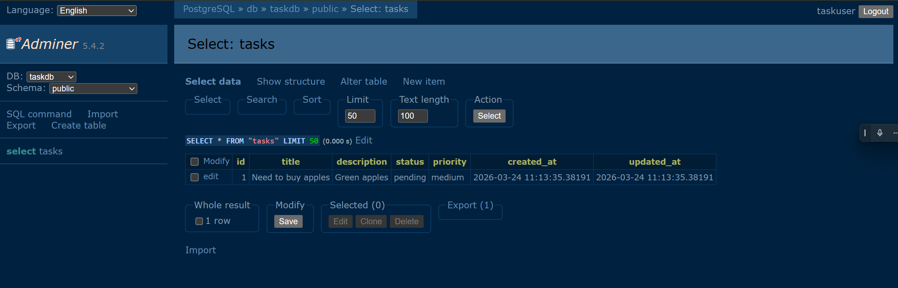
  <p><em>Adminer interface displaying the tasks table</em></p>
</div>

<div align="center">
  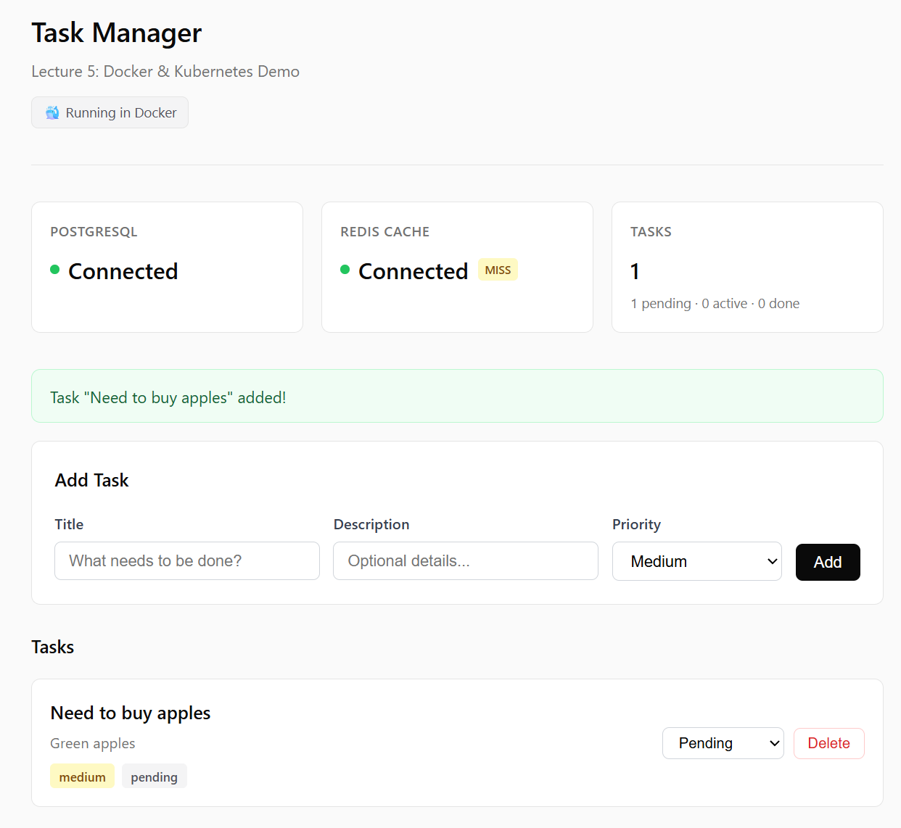
  <p><em>Web application interface showing the created task</em></p>
</div>

---

## (b) Change Base Image (Slim → Alpine)


### Changes made

Modified the base image in the `Dockerfile`:

```dockerfile
FROM python:3.11-alpine
```

---

### a) Required changes to make Alpine work

No additional system dependencies were required in this specific case.

Reason:

* The package `psycopg2-binary` provides **precompiled musl-compatible wheels**
* pip installed a binary wheel instead of compiling from source

However, in general, Alpine images often require installing additional system and build dependencies due to the absence of glibc and the need to compile native extension, which would be fixed by adding:

```bash
apk add gcc musl-dev libpq-dev
```

if precompiled wheels are not available.

---


### b) Build both images

#### Build slim image

```bash
docker build --no-cache -t task-app:slim .
```

<div align="center">
  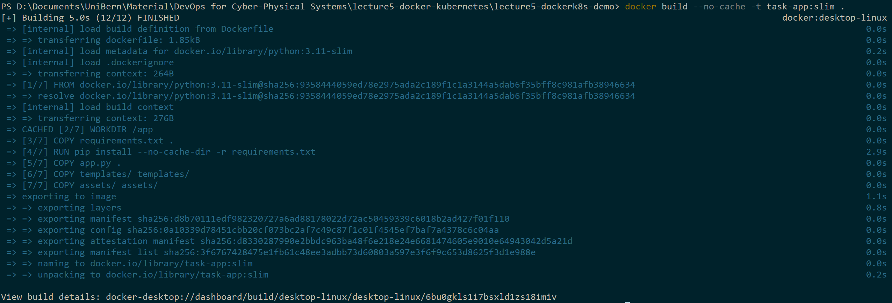
  <p><em>Building the slim-based Docker image</em></p>
</div>


#### Build Alpine image

```bash
docker build --no-cache -t task-app:alpine .
```

<div align="center">
  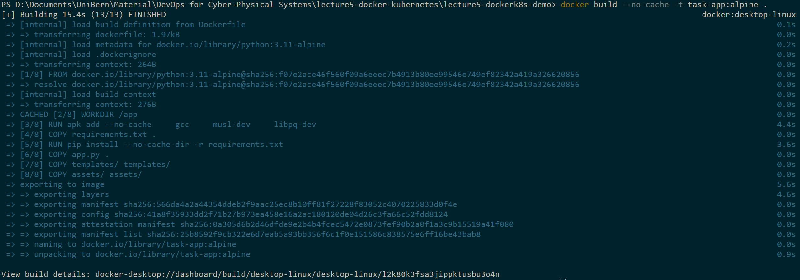
  <p><em>Building the Alpine-based Docker image</em></p>
</div>

---

### c) Size comparison and build observations

#### Without additional Alpine dependencies (`apk add`)

| IMAGE             | ID           | DISK USAGE | CONTENT SIZE | EXTRA |
|------------------|-------------|------------|--------------|-------|
| task-app:alpine  | f1ea872c186e | 127MB      | 31MB         |       |
| task-app:slim    | 3f6767428475 | 232MB      | 56.6MB       |       |

<div align="center">
  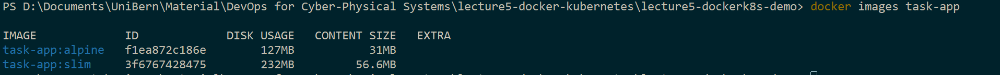
  <p><em>Image size comparison without additional Alpine dependencies</em></p>
</div>

---

#### With additional Alpine dependencies (`apk add gcc musl-dev libpq-dev`)

| IMAGE             | ID           | DISK USAGE | CONTENT SIZE | EXTRA |
|------------------|-------------|------------|--------------|-------|
| task-app:alpine  | fffd3a0e12ec | 410MB      | 107MB        |       |
| task-app:slim    | 3f6767428475 | 232MB      | 56.6MB       |       |

<div align="center">
  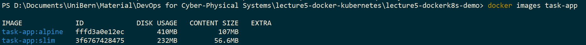
  <p><em>Image size comparison after installing build dependencies in Alpine</em></p>
</div>

---

### Observations

- The Alpine image without additional dependencies is significantly smaller than the slim version.
- When installing build dependencies (`gcc`, `musl-dev`, `libpq-dev`), the Alpine image becomes substantially larger than the slim image.
- This demonstrates that Alpine's size advantage depends on avoiding compilation toolchains.

In conclusion, although no changes were required in this case due to the **availability of precompiled wheels**, Alpine images can require additional system dependencies in many other scenarios. When such dependencies are needed, the **resulting image size can exceed that of the slim-based image**, reducing or eliminating the expected size benefit.

---

# Task 2: Docker Operations

## (a) Image Tagging and Registry

### a) Build the image with a version tag

The Docker image was built using a version tag, and was later tagged with my Docker Hub username.

```bash
docker build -t task-app:v1.0 .
docker tag task-app:v1.0 aagdockerdev/task-app:v1.0
```

<div align="center">
  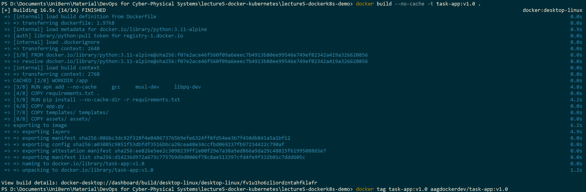
  <p><em>Building the Docker image with version tag v1.0 and tagging the image with Docker Hub username</em></p>
</div>

### b) Create a Docker Hub account and push the image

I already had a Docker Hub account, where the image was pushed to the registry.


##### Docker Hub Username

> aagdockerdev

Then, authentication was performed:

```bash
docker login
```
<div align="center">
  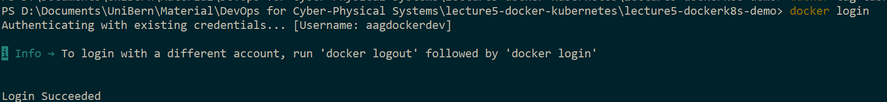
  <p><em>Logging in to Docker Hub account</em></p>
</div>


Finally, the image was pushed:

```bash
docker push aagdockerdev/task-app:v1.0
```

<div align="center">
  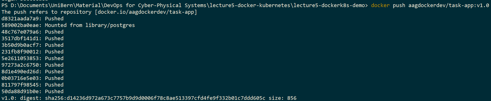
  <p><em>Pushing the Docker image to Docker Hub</em></p>
</div>

---

### c) Verification on Docker Hub

The uploaded image was verified on Docker Hub, confirming that the repository and tagged version were successfully published.

<div align="center">
  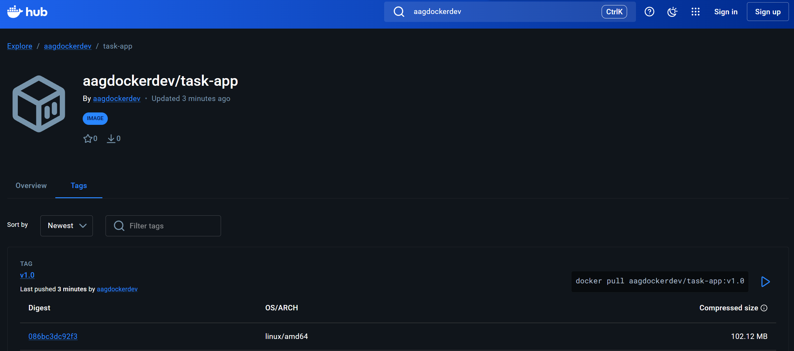
  <p><em>Docker Hub repository showing the uploaded image (v1.0)</em></p>
</div>


---

## (b) Container Inspection

With the application running, the following commands were used to inspect container behavior and state.

### 1. View container logs

```bash
docker compose logs web
```

**Explanation:**

This command displays the logs generated by the `web` service container. It is useful for debugging, monitoring application output, and verifying that the application started correctly.

<div align="center">
  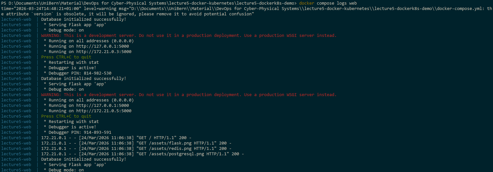
  <p><em>Logs of the web container showing application output</em></p>
</div>

### 2. Inspect container details

```bash
docker inspect lecture5-web
```

**Explanation:**

This command returns detailed low-level information about the container in JSON format, including configuration, environment variables, network settings, mounted volumes, and runtime state.

<div align="center">
  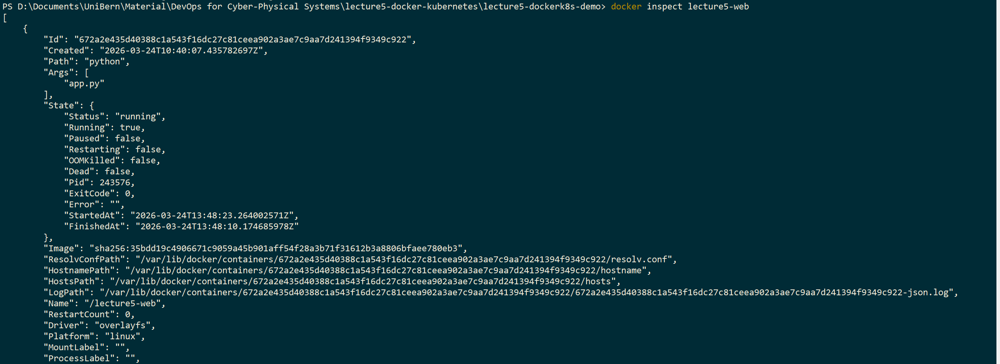
  <p><em>Detailed container configuration and metadata from docker inspect</em></p>
</div>


### 3. Monitor container resource usage

```bash
docker stats
```

**Explanation:**

This command provides real-time metrics for running containers, including CPU usage, memory consumption, network I/O, and block I/O. It is useful for monitoring performance and detecting resource bottlenecks.

<div align="center">
    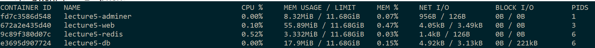
  <p><em>Real-time resource usage statistics of running containers</em></p>
</div>

---

# Task 3: Deploy to Kubernetes

---

## (a) Deploy the Application

### a) Start Minikube

The Kubernetes cluster was started locally using Minikube:

```bash
minikube start
```

<div align="center">
  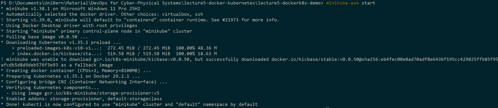
  <p><em>Minikube cluster initialization</em></p>
</div>

---

### b) Deploy backend and web services

The backend (PostgreSQL + Redis) and the web application were deployed using the provided Kubernetes manifests:

```bash
kubectl apply -f k8s-backend.yaml
kubectl apply -f k8s-web.yaml
```

<div align="center">
  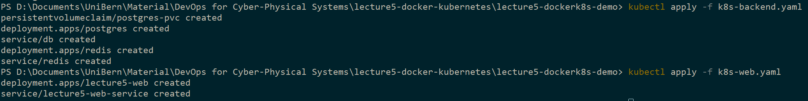
  <p><em>Deploying backend and web services to Kubernetes</em></p>
</div>

---

### c) Build Docker image

The application image was built with my Docker Hub username:

```bash
docker build -t aagdockerdev/lecture5-webapp:v1.0 .
```

<div align="center">
  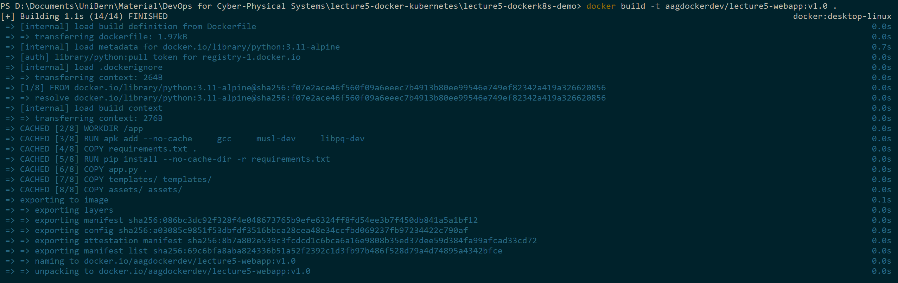
  <p><em>Building Docker image for deployment</em></p>
</div>

---

### d) Push image and update Kubernetes configuration

The image was pushed to Docker Hub:

```bash
docker push aagdockerdev/lecture5-webapp:v1.0
```

Then, the image field in `k8s-web.yaml` was updated:

```yaml
image: aagdockerdev/lecture5-webapp:v1.0
```

<div align="center">
  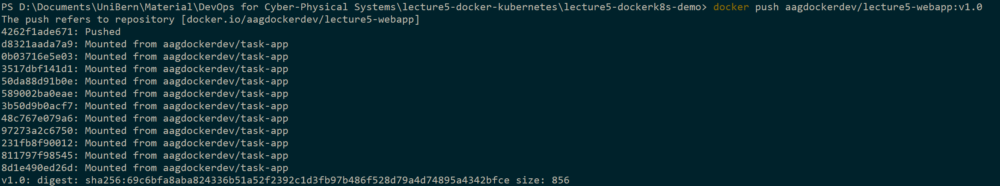
  <p><em>Pushing the image to Docker Hub</em></p>
</div>

---

### e) Access the application

The application was accessed using:

```bash
minikube service lecture5-web-service
```

This command exposes the service and opens it in the browser.

<div align="center">
  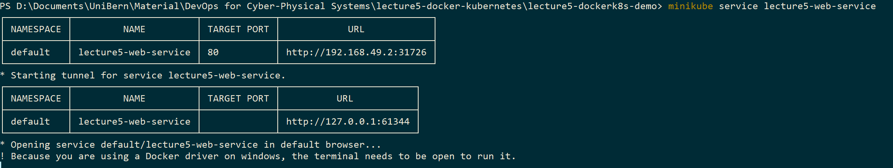
  <p><em>Accessing the deployed service through Minikube</em></p>
</div>

---

### f) Verification

The running pods were verified using the following command:

```bash
kubectl get pods
```

<div align="center">
  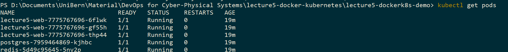
  <p><em>Running pods in the Kubernetes cluster</em></p>
</div>


Additionally, the application was successfully deployed and accessible in the browser:

<div align="center">
  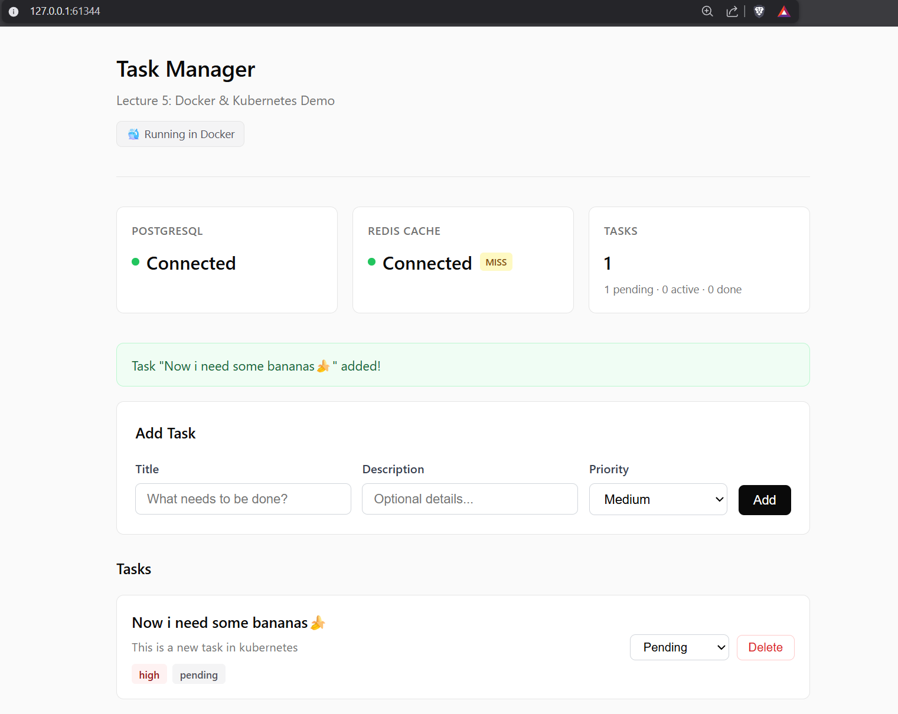
  <p><em>Web application running in the browser with tasks displayed</em></p>
</div>
---


## (b) Scale and Test Load Balancing

### a) Scale the deployment to 5 replicas

The number of replicas of the web application was increased to 5:

```bash
kubectl scale deployment lecture5-web --replicas=5
kubectl get pods
```

<div align="center">
  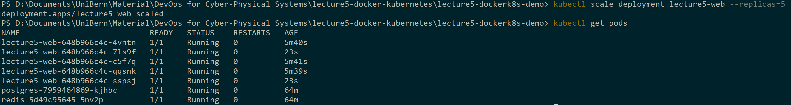
  <p><em>Scaling the web deployment to 5 replicas, and checking afterwards with the number of pods</em></p>
</div>

---

### b, c) Run load balancing test and results

The provided script was slightly modified to accept the service port as a command-line argument. This was necessary because Minikube dynamically assigns a local port when exposing services via `minikube service`. The script was executed to simulate multiple requests:

```bash
python test_load_balancing.py --port 54595
```

<div align="center">
  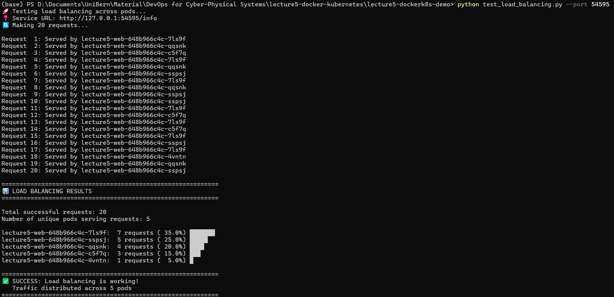
  <p><em>Executing load balancing test script</em></p>
</div>

The output shows that requests are distributed across multiple pods, confirming that load balancing is functioning correctly. Each request is served by a different pod instance, identified by its unique hostname (e.g., `lecture5-web-648b966c4c-7ls9f`).

A total of 20 requests were sent, and all 5 replicas handled traffic. The distribution is not perfectly uniform, which is expected due to the probabilistic nature of request routing, but all pods received at least one request. This demonstrates that the Kubernetes Service is correctly balancing traffic across available replicas.

---

### d) Explanation: How Kubernetes distributes traffic

Kubernetes distributes incoming traffic through a Service, which acts as a **stable endpoint and load balances requests** across all healthy pods that match its selector. The Service relies on **kube-proxy** to forward traffic at the network level, typically resulting in an approximately even distribution (often perceived as round-robin) across replicas. In this setup, the **LoadBalancer** service exposed via Minikube **forwards requests to the backend pods**, ensuring scalability and fault tolerance even if individual pods fail.

---

## (c) Self-Healing

### a,b) Delete a pod and observe pod reaction

A running pod was manually deleted:

```bash
kubectl delete pod lecture5-web-648b966c4c-7ls9f
```

And the cluster state was monitored repeatedly:

```bash
kubectl get pods
```


<div align="center">
  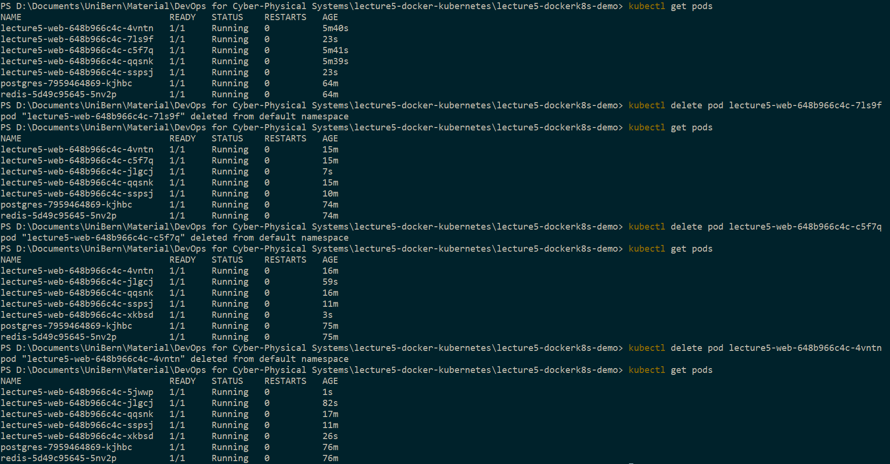
  <p><em>Deleting one of the running web pods multiple times. Pods before, during and after deletion each time</em></p>
</div>


### Observations

After each pod deletion, a new pod with a different name (e.g., `jlgcj`, `xkbsd`, `5jwwp`) is created almost immediately. The AGE field confirms that these are newly created instances (e.g., a few seconds old), while the total number of running pods remains constant at 5.

This demonstrates that the Deployment controller continuously monitors the cluster state and ensures that the desired number of replicas is maintained, replacing any terminated pod automatically.


### c) Explanation: Why self-healing is important

Kubernetes ensures that the **desired state defined in a Deployment** is **continuously maintained**. When a pod is deleted or fails, the controller automatically creates a new one to replace it. This self-healing capability guarantees **high availability and resilience**, allowing applications to recover from failures autonomously, without manual intervention.


<!-- ################################################ -->
<!-- ################################################ -->
<!-- ############## OLD README CONTENT ############## -->
<!-- ################################################ -->
<!-- ################################################ -->

<hr style="border: none; height: 3px; background-color: #444;">

# OLD README.md content

# Lecture 5: Docker & Kubernetes Demo

> DevOps for Cyber-Physical Systems | University of Bern

A Task Manager app demonstrating Docker containerization and Kubernetes orchestration.

## Architecture

**Docker Compose:**
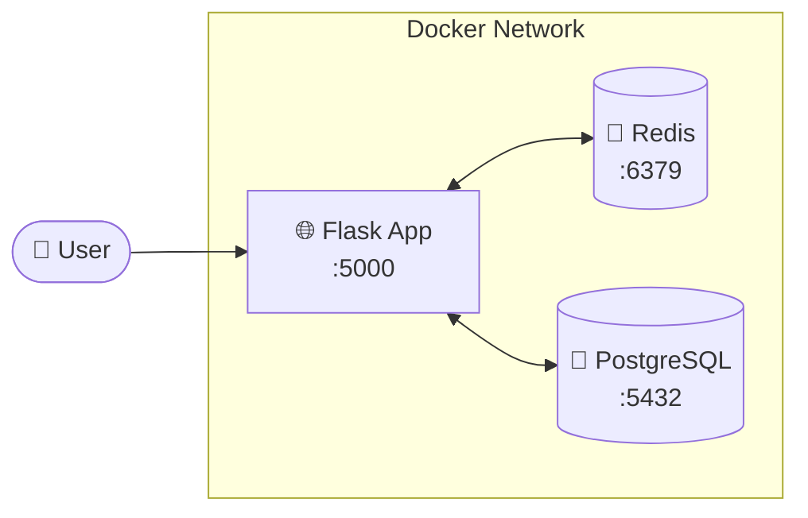

**Kubernetes:**
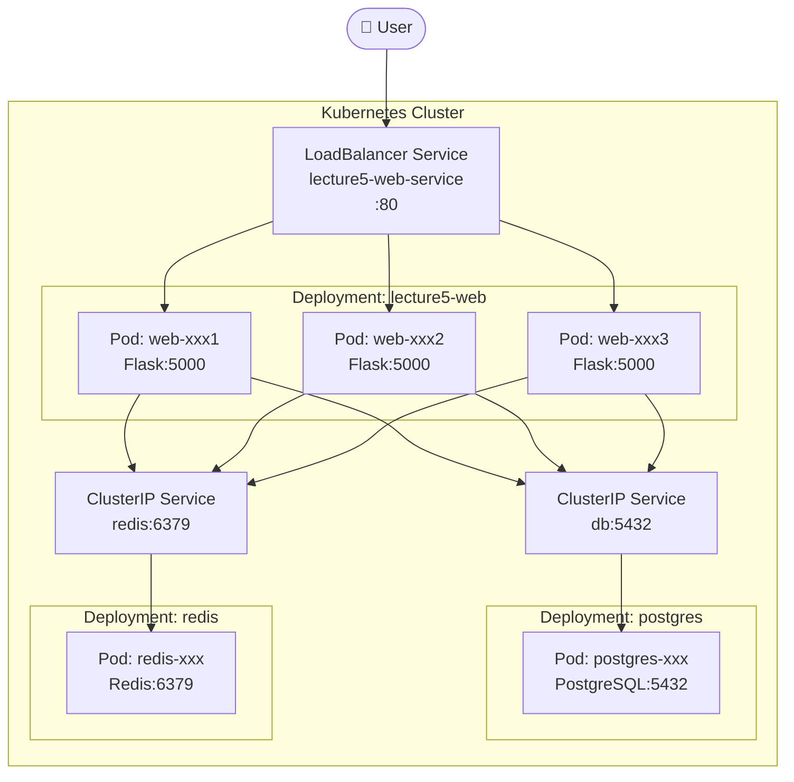

## Project Structure

```
lecture5-docker-demo/
├── app.py              # Flask application
├── Dockerfile          # Build instructions
├── docker-compose.yml  # Multi-service setup
├── k8s-backend.yaml    # K8s: PostgreSQL + Redis
├── k8s-web.yaml        # K8s: Web app deployment
├── test_load_balancing.py  # Load balancing test
├── templates/
│   └── index.html      # Web UI
└── assets/             # Logo images
```

---

# Part 1: Docker 🐳

## Quick Start with Docker Compose

```bash
# Start all services
docker compose up

# Open http://localhost:5000

# Stop
docker compose down
```

## Docker Commands Reference

| Command | Description |
|---------|-------------|
| `docker compose up` | Start all services |
| `docker compose down` | Stop all services |
| `docker compose down -v` | Stop + delete data |
| `docker compose logs -f` | View logs |
| `docker compose exec db psql -U taskuser -d taskdb` | Access database |
| `docker compose exec redis redis-cli` | Access Redis |

## Building Your Own Docker Image

**Option 1: Build yourself**
```bash
docker build -t YOUR-USERNAME/lecture5-webapp:v1.0 .
docker push YOUR-USERNAME/lecture5-webapp:v1.0
```

**Option 2: Use pre-built image**
```bash
# Use merabro/lecture5-webapp:v1.1 in your deployments
# Already built and available on Docker Hub
```

---

# Part 2: Kubernetes ☸️

## Prerequisites

Install Minikube for local Kubernetes:
- **Windows/Mac**: Enable Kubernetes in Docker Desktop Settings
- **All platforms**: Install Minikube from https://minikube.sigs.k8s.io/

## Step 1: Start Minikube

```bash
minikube start
```

<details>
<summary>Expected Output</summary>

```
😄  minikube v1.37.0 on Microsoft Windows 11
✨  Automatically selected the docker driver
👍  Starting "minikube" primary control-plane node in "minikube" cluster
🔥  Creating docker container (CPUs=2, Memory=7900MB) ...
🐳  Preparing Kubernetes v1.34.0 on Docker 28.4.0 ...
🔗  Configuring bridge CNI (Container Networking Interface) ...
🔎  Verifying Kubernetes components...
🌟  Enabled addons: storage-provisioner, default-storageclass
🏄  Done! kubectl is now configured to use "minikube" cluster
```
</details>

## Step 2: Build and Push Docker Image

```bash
# Build the image
docker build -t merabro/lecture5-webapp:v1.1 .

# Login to Docker Hub
docker login

# Push to Docker Hub
docker push merabro/lecture5-webapp:v1.1
```

<details>
<summary>Expected Output</summary>

```
[+] Building 9.2s (13/13) FINISHED
 => [1/7] FROM docker.io/library/python:3.11-slim
 => [2/7] WORKDIR /app
 => [3/7] COPY requirements.txt .
 => [4/7] RUN pip install --no-cache-dir -r requirements.txt
 => [5/7] COPY app.py .
 => [6/7] COPY templates/ templates/
 => [7/7] COPY assets/ assets/
 => exporting to image

The push refers to repository [docker.io/merabro/lecture5-webapp]
v1.1: digest: sha256:a827246ae97bcc39ab8930e90935690d71aec1bb54a46d92751b478fdd647481
```
</details>

## Step 3: Deploy Backend Services (PostgreSQL + Redis)

```bash
kubectl apply -f k8s-backend.yaml
```

<details>
<summary>Expected Output</summary>

```
persistentvolumeclaim/postgres-pvc created
deployment.apps/postgres created
service/db created
deployment.apps/redis created
service/redis created
```
</details>

Check backend pods:
```bash
kubectl get pods
```

<details>
<summary>Expected Output</summary>

```
NAME                        READY   STATUS    RESTARTS   AGE
postgres-5695fbfd64-mlcqw   1/1     Running   0          14s
redis-57566c54f6-nzbtj      1/1     Running   0          14s
```
</details>

## Step 4: Deploy Web Application

```bash
kubectl apply -f k8s-web.yaml
```

<details>
<summary>Expected Output</summary>

```
deployment.apps/lecture5-web created
service/lecture5-web-service created
```
</details>

Check all resources:
```bash
kubectl get deployments
kubectl get services
kubectl get pods
```

<details>
<summary>Expected Output</summary>

```
NAME           READY   UP-TO-DATE   AVAILABLE   AGE
lecture5-web   3/3     3            3           67s
postgres       1/1     1            1           101s
redis          1/1     1            1           101s

NAME                   TYPE           CLUSTER-IP       PORT(S)        AGE
db                     ClusterIP      10.99.17.144     5432/TCP       104s
kubernetes             ClusterIP      10.96.0.1        443/TCP        5m5s
lecture5-web-service   LoadBalancer   10.107.153.104   80:30262/TCP   70s
redis                  ClusterIP      10.99.151.191    6379/TCP       104s

NAME                           READY   STATUS    RESTARTS   AGE
lecture5-web-5c5d44c79-7zb57   1/1     Running   0          75s
lecture5-web-5c5d44c79-n4zx5   1/1     Running   0          75s
lecture5-web-5c5d44c79-qqqdx   1/1     Running   0          75s
postgres-5695fbfd64-mlcqw      1/1     Running   0          109s
redis-57566c54f6-nzbtj         1/1     Running   0          109s
```
</details>

## Step 5: Access the Application

```bash
minikube service lecture5-web-service
```

<details>
<summary>Expected Output</summary>

```
┌───────────┬──────────────────────┬─────────────┬────────────────────────┐
│ NAMESPACE │         NAME         │ TARGET PORT │          URL           │
├───────────┼──────────────────────┼─────────────┼────────────────────────┤
│ default   │ lecture5-web-service │             │ http://127.0.0.1:63501 │
└───────────┴──────────────────────┴─────────────┴────────────────────────┘
🏃  Starting tunnel for service lecture5-web-service.
🎉  Opening service default/lecture5-web-service in default browser...
```
</details>

The browser will automatically open to the app!

## Step 6: Demo - Scaling

Scale the web app from 3 to 5 replicas:

```bash
kubectl scale deployment lecture5-web --replicas=5
kubectl get pods
```

<details>
<summary>Expected Output</summary>

```
deployment.apps/lecture5-web scaled

NAME                           READY   STATUS    RESTARTS   AGE
lecture5-web-5c5d44c79-7zb57   1/1     Running   0          2m33s
lecture5-web-5c5d44c79-hjn25   1/1     Running   0          7s
lecture5-web-5c5d44c79-n4zx5   1/1     Running   0          2m33s
lecture5-web-5c5d44c79-qqqdx   1/1     Running   0          2m33s
lecture5-web-5c5d44c79-xtgp5   1/1     Running   0          7s
postgres-5695fbfd64-mlcqw      1/1     Running   0          3m7s
redis-57566c54f6-nzbtj         1/1     Running   0          3m7s
```
</details>

## Step 7: Demo - Rolling Update

Update the app to a new version:

```bash
kubectl set image deployment/lecture5-web web=merabro/lecture5-webapp:v1.1
kubectl rollout status deployment/lecture5-web
```

<details>
<summary>Expected Output</summary>

```
deployment.apps/lecture5-web image updated
Waiting for deployment "lecture5-web" rollout to finish: 1 old replicas are pending termination...
Waiting for deployment "lecture5-web" rollout to finish: 1 old replicas are pending termination...
deployment "lecture5-web" successfully rolled out
```
</details>

## Step 8: Test Load Balancing

Run the load balancing test:

```bash
# Install requests library
pip install requests

# Run test
python test_load_balancing.py
```

<details>
<summary>Expected Output</summary>

```
🚀 Testing load balancing across pods...
📍 Service URL: http://127.0.0.1:63501/info
🔄 Making 20 requests...

Request  1: Served by lecture5-web-dd74c46f6-c26t2
Request  2: Served by lecture5-web-dd74c46f6-jk2jm
Request  3: Served by lecture5-web-dd74c46f6-jk2jm
...
Request 20: Served by lecture5-web-dd74c46f6-jk2jm

============================================================
📊 LOAD BALANCING RESULTS
============================================================

Total successful requests: 20
Number of unique pods serving requests: 5

lecture5-web-dd74c46f6-9vpgq:  5 requests ( 25.0%) █████
lecture5-web-dd74c46f6-c26t2:  4 requests ( 20.0%) ████
lecture5-web-dd74c46f6-jk2jm:  4 requests ( 20.0%) ████
lecture5-web-dd74c46f6-pv2tc:  4 requests ( 20.0%) ████
lecture5-web-dd74c46f6-pmgjm:  3 requests ( 15.0%) ███

============================================================
✅ SUCCESS: Load balancing is working!
   Traffic distributed across 5 pods
============================================================
```
</details>

## Kubernetes Dashboard (Optional)

View your cluster in a web UI:

```bash
minikube dashboard
```

This opens a visual dashboard showing all your deployments, pods, services, and resource usage.

## Useful kubectl Commands

| Command | Description |
|---------|-------------|
| `kubectl get pods` | List all pods |
| `kubectl get deployments` | List all deployments |
| `kubectl get services` | List all services |
| `kubectl logs POD_NAME` | View pod logs |
| `kubectl describe pod POD_NAME` | Detailed pod info |
| `kubectl exec -it POD_NAME -- /bin/bash` | Shell into pod |
| `kubectl delete pod POD_NAME` | Delete pod (auto-recreates) |
| `kubectl scale deployment NAME --replicas=N` | Scale deployment |

## Cleanup

```bash
# Delete everything
kubectl delete -f k8s-web.yaml
kubectl delete -f k8s-backend.yaml

# Stop Minikube
minikube stop

# Delete Minikube cluster
minikube delete
```

---

## How It Works

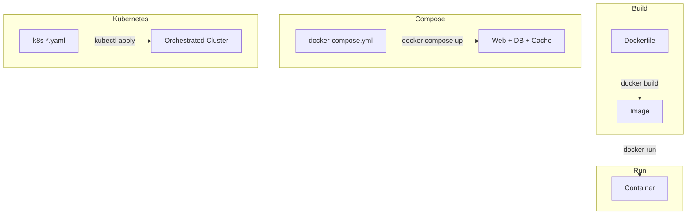

**Dockerfile** → Recipe to build an image  
**Image** → Snapshot of your app + dependencies  
**Container** → Running instance of an image  
**Compose** → Run multiple containers together  
**Kubernetes** → Orchestrate containers at scale with auto-scaling, self-healing, load balancing

---

**University of Bern | DevOps for Cyber-Physical Systems**